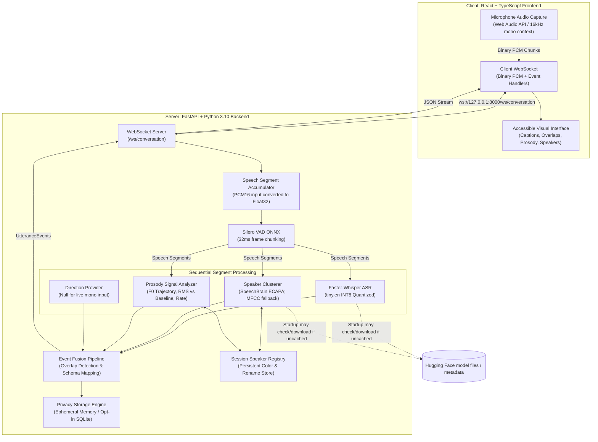
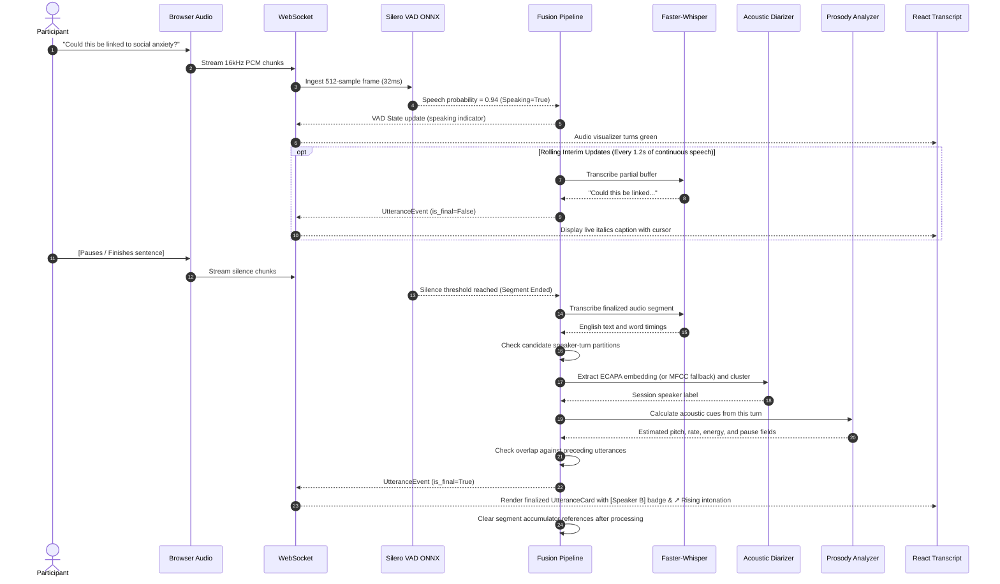

# Hackcessible India 2026 — System Architecture

## Overview
Hackcessible is a local web-app prototype for displaying English captions with session-level speaker labels and acoustic cues. Its accuracy and accessibility have not been formally evaluated.

Standard live captions communicate only **what** was said. Hackcessible transforms spoken dialogue into an accessible visual conversation interface by simultaneously communicating:
1. **WHO** is speaking (session-level speaker clusters and color-text badges; not verified identities)
2. **WHAT** they said (English speech-to-text with rolling interim updates)
3. **WHEN** speech may overlap (live heuristic and scripted demo events; not benchmarked)
4. **HOW** it was said (estimated acoustic cues: pitch, energy, speaking rate, pauses)
5. **WHERE** a speaker is located (simulated demo values only; live mono input reports no direction)

---

## High-Level Pipeline Flow



---

## Sequence Diagram: Live Utterance Lifecycle



---

## Event Data Model

The pipeline communicates through a strongly-typed, JSON-serializable event model:

```json
{
  "id": "utt-8f4b-4a31-92b1",
  "session_id": "session_1774431800",
  "start_time": 14.2,
  "end_time": 17.6,
  "speaker_id": "speaker_2",
  "speaker_label": "Speaker B (Priya)",
  "speaker_color_index": 1,
  "text": "Could this pattern be explained primarily by social anxiety disorder?",
  "is_final": true,
  "overlap": false,
  "overlapping_speakers": [],
  "prosody": {
    "rising_intonation": true,
    "falling_intonation": false,
    "emphasis": false,
    "long_pause_before": false,
    "speech_rate": "normal",
    "relative_volume": "normal",
    "mean_pitch_hz": 218.6,
    "rms_db": -20.8,
    "words_per_minute": 156.0
  },
  "direction": {
    "angle_degrees": 0.0,
    "label": "front",
    "simulated": true,
    "confidence": 0.88
  },
  "confidence": {
    "transcription": 0.94,
    "speaker": 0.91
  }
}
```

---

## Models and external startup requests

Speech inference uses local models once they are available. Faster-Whisper and SpeechBrain can contact Hugging Face during model setup to check or fetch files; the live inference path does not send audio or transcripts to a cloud speech API. Pipeline processing time measures backend work after a segment closes and is not full user-perceived caption latency.

## Loose Coupling and Modularity

Every major subsystem is decoupled behind clean abstract interfaces:

1. **`BaseASR`** (`backend/app/asr/base.py`):
   Allows swapping Faster-Whisper (`tiny.en`, `base.en`, `small.en`) with Whisper.cpp, Vosk, or multilingual models.
2. **`BaseDiarizer`** (`backend/app/diarization/base.py`):
   Separates session-level speaker clustering from speech recognition; the current clusterer uses ECAPA-TDNN with an MFCC fallback.
3. **`DirectionProvider`** (`backend/app/direction/base.py`):
   Returns no direction for live mono audio. Demo records contain simulated direction values; the future array class is only a placeholder.
4. **`SessionStorage`** (`backend/app/storage/database.py`):
   Keeps transcripts in memory by default; persistence requires Privacy Mode off and explicit transcript-save opt-in.
